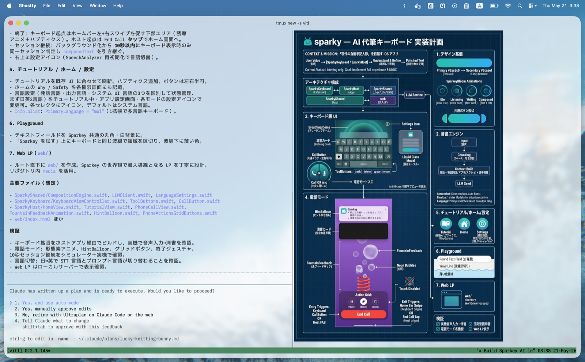

# [Agent Skills][skills]: _Visual-in-the-Loop_

[English](README.md) | **日本語**

> エージェントが判断を求めるとき、人に渡すのは "テキストの壁" ではなく 1 枚のビジュアル。

Claude Code・Codex・spec-kit が出すプランは、たいてい「テキストの壁」です。この
スキルは、エージェントが `ExitPlanMode` や `AskUserQuestion` を呼ぶ**直前に**、
そのプランを [Nano Banana 2][nano] で **1 枚のビジュアルサマリー**に描き起こして、
あなたに見せます。



[skills]: https://code.claude.com/docs/en/skills
[nano]: https://deepmind.google/models/gemini-image

## インストール

### [`skills` CLI][skills-cli] を使う (推奨)

```bash
npx skills add taniiicom/visual-in-the-loop
```

`~/.claude/skills/visual-in-the-loop/` にインストールされ、Claude Code が次の
セッションで自動的に読み込みます。

### 手動 (clone + symlink)

```bash
git clone https://github.com/taniiicom/visual-in-the-loop.git
ln -s "$(pwd)/visual-in-the-loop/skills/visual-in-the-loop" \
      ~/.claude/skills/visual-in-the-loop
```

[skills-cli]: https://github.com/vercel-labs/skills

## セットアップ

**1. Gemini API キー** _(必須)_。[Google AI Studio][aistudio] で取得し、環境変数に
エクスポートします (どちらの名前でも可):

```bash
export GEMINI_API_KEY=...   # または GOOGLE_API_KEY
```

永続化するには `~/.zshrc` / `~/.bashrc`、または `~/.claude/settings.json` の
`env` キーに追加してください。Vertex AI・OpenAI・Azure などほかのプロバイダにも
対応しています — [設定](#設定)を参照。

**2. Node.js 18+** _(必須)_。組み込みの `fetch` を使うため、`npm install` も
`package.json` も不要です。

**3. 表示ツール** _(任意 — 無くても自動でフォールバックします)_:
ターミナル内プレビューには `chafa` + `tmux`、VS Code タブには `code` CLI、
あるいは OS の画像ビューア (`open` / `xdg-open`、常に利用可能) のいずれか。

[aistudio]: https://aistudio.google.com/apikey

## 仕組み

1. プランのレビューを求める直前に、エージェントが**プラン本文をそのまま**スキルへ
   渡します。
2. スキルは Gemini を 1 回呼び出し、PNG を 1 枚保存します — プラン全体が 1 枚の
   図になります。
3. 環境を検出して画像を表示します:
   - **tmux** (`chafa` あり) → サイドペインに実画像、ペインサイズに合わせて表示
   - **VS Code / Cursor / Windsurf** → 画像入りの markdown タブ
   - **macOS** → `open` (プレビュー) ・ **Linux** → `xdg-open`
4. 画像が画面に出た**あとで**、エージェントが質問を表示します — 図を見ながら
   判断できます。

何か失敗しても (キー無し・ネットワーク不通・表示経路無しなど) スキルは静かに
終了し、エージェントは通常どおり質問します。会話を止めることはありません。

## 試してみる

同梱のサンプルプランでインストールをスモークテストできます — 返ってくる画像は
スキル自体の説明図になっているので、チュートリアルも兼ねます:

```bash
cat ~/.claude/skills/visual-in-the-loop/references/sample-plan.md \
  | bash ~/.claude/skills/visual-in-the-loop/scripts/run.sh
```

stdout に `[visual-in-the-loop] rendered: …png` が出て画像が表示されれば成功
です。あとは Claude Code のセッションを開始して、ある程度の規模のプランを依頼
してみてください — エージェントが `ExitPlanMode` / `AskUserQuestion` に達した
とき、質問より先に図が表示されます。

## 設定

設定はすべて環境変数です。シェル、または `~/.claude/settings.json` の `env`
キーに置けば、毎セッションに適用されます:

```jsonc
// ~/.claude/settings.json
{
  "env": {
    "GEMINI_API_KEY": "AIza...",
    "VITL_PROVIDER": "gemini",
    "VITL_ASPECT_RATIO": "2:3",
    "VITL_DISPLAY": "auto"
  }
}
```

| 変数 | 値 | デフォルト | 用途 |
| --- | --- | --- | --- |
| `VITL_ENABLED` | `1` / `0` (`true`/`false`/`yes`/`no`/`on`/`off` も可) | on | マスタースイッチ。`0`/`false`/`no`/`off` のときだけ無効化。 |
| `VITL_PROVIDER` | `gemini` / `vertexai` / `openai` / `azure` | `gemini` | 呼び出す API。 |
| `VITL_MODEL` | プロバイダ固有の ID | プロバイダのデフォルト | 例: 無料枠の Gemini なら `gemini-2.5-flash-image`。 |
| `VITL_ASPECT_RATIO` | `2:3`, `3:4`, `9:16`, `1:1`, `16:9`, … | `2:3` (縦長) | 画像の縦横比。Gemini / Vertex はそのまま使用、OpenAI / Azure は近いサイズにマッピング。 |
| `VITL_LANG` | 言語名 (`Japanese`, `English`, …) | 未設定 | 図のテキストの言語。通常はエージェントが `--lang` で都度指定し、この環境変数は静的なフォールバック。 |
| `VITL_DISPLAY` | `auto` / `tmux` / `vscode` / `open` / `none` | `auto` | 表示経路を固定、または `none` で表示抑制。使えない値は `auto` にフォールバック。 |
| `VITL_TRIGGER` | カンマ区切り (`plan,clarify,decision`) または `all` | `all` | どの判断タイミングで生成を発火するか。 |

### プロバイダ別の環境変数

| `VITL_PROVIDER` | 必要な環境変数 | デフォルトの `VITL_MODEL` |
| --- | --- | --- |
| `gemini` | `GEMINI_API_KEY` _または_ `GOOGLE_API_KEY` | `gemini-3-pro-image-preview` |
| `vertexai` | `VITL_VERTEX_PROJECT` + `VITL_VERTEX_LOCATION` (認証は `gcloud auth application-default login`) | `gemini-3-pro-image-preview` |
| `openai` | `OPENAI_API_KEY` | `gpt-image-1` |
| `azure` | `AZURE_OPENAI_API_KEY` + `AZURE_OPENAI_ENDPOINT` + `AZURE_OPENAI_DEPLOYMENT` (任意で `AZURE_OPENAI_API_VERSION`) | デプロイメントで決まる |

Vertex AI ではスキルが `gcloud auth application-default print-access-token` を
呼び出します (追加の依存なし)。[gcloud CLI][gcloud] をインストールして一度認証
してください。

[gcloud]: https://cloud.google.com/sdk/docs/install

### フェイルセーフ

設定に何を書いても、会話が黙って壊れることはありません:

- エージェントが `--trigger` を渡し忘れても生成は実行されます (ビジュアルを
  取りこぼさない)。
- ここで使えない `VITL_DISPLAY` は警告を出して `auto` にフォールバックします。
- 認識できる偽値でない `VITL_ENABLED` は有効のままです。

## チューニング

調整できる**ノブは 1 つだけ**:
`skills/visual-in-the-loop/references/prompt-template.md`。1 行のファイルです。
図が狙いから外れる場合はこのファイルを編集してください — `generate.mjs` に
ヒューリスティックを足さないこと。モデルを信頼しましょう。

## トラブルシューティング

| 症状 | 対処 |
| --- | --- |
| エージェントが質問の前にスキルを呼ばない | `SKILL.md` の `description:` をより強めに書き、セッションを再起動。 |
| `no display path available` | `$TMUX`+chafa・VS Code・`open`・`xdg-open` のいずれも無い環境。どれかを入れる (リモート `ssh` では想定どおり)。 |
| stderr に `API <status>: …` | たいていは API キーの未設定 / 不正。エージェントの質問は画像なしで進みます。 |
| 画像は生成されたが tmux に出ない | `chafa` を入れる (`brew install chafa`)。無いと `open` にフォールバックします。 |

## 設計メモ

コードからは読み取りにくい、意図的な設計判断:

- **Mermaid / D2 へのフォールバックは無し。** このスキルは「構造図のレイヤでは
  プランの可視化に足りない」_からこそ_存在します。切り替えを足さないこと。
- **同期実行、バックグラウンドにしない。** 生成には約 5〜15 秒かかります。画像が
  揃う前に質問を出すと、中途半端なレビュー画面にユーザを呼び寄せてしまう —
  まさにこのスキルが防ぎたい摩擦です。
- **画像を見るのはエージェントではなく人間。** エージェントには PNG のパスしか
  返りません。画像は人間の目への別経路です。
- **プランは verbatim で渡す。** プランを要約してスキルに渡さないこと — 図の
  品質はモデルが受け取るテキストの質で決まります。

## ロードマップ

- `references/hook-example.md` — Claude Code の `PreToolUse` /
  `PermissionRequest` の matcher が `AskUserQuestion` / `ExitPlanMode` に対して
  安定したら、エージェントの判断に頼らず確実に発火する任意の hook を追加します。

## ライセンス

MIT。

## コントリビュート

Issue・PR を歓迎します。スキルはミニマルに保ってください — 依存・環境変数・
フォールバック経路を増やす変更の PR には、`references/prompt-template.md` の
編集で解決できない理由を書いてください。
